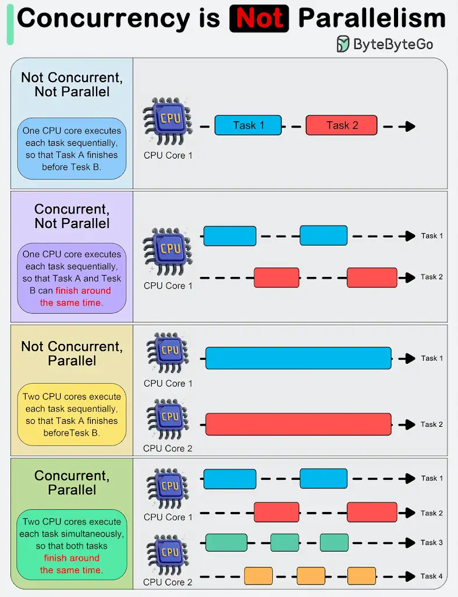
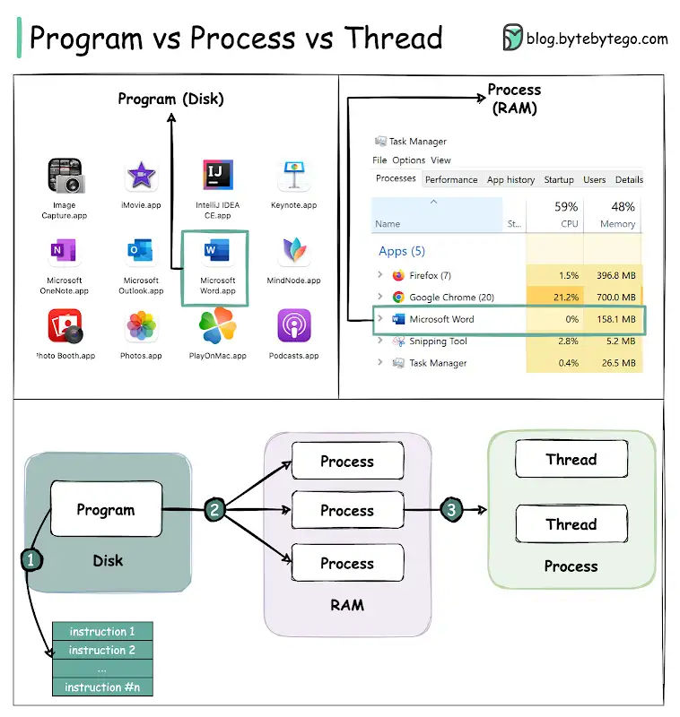

# Multithreading

- Program is run in a thread (main thread)
- Hyper-Threading/SMT allows CPU core to handle both threads at the same time
- CPU thread priorities are managed by OS, but it can be configured
- Program performance using multiple threads depends on what hardware it is running on.



# Concurrent programming

Concurrent programming made it possible to solve the problem of multitasking when the first OS were created, even with only 1 CPU core.
During concurrent programming, there is a **context switching**, that is imperceptible to humans (looks like parallelism).

# Asynchronous programming

Solves the problem of blocking threads (not concurrency or parallelism).

Used for I/O operations that are beyond the scope of the application and require processing time in an external program:

- network resources
- disk write & read
- memory
- database

After calling an I/O operation, we can wait for the result:

- synchronously, blocking the resources until the result is returned
- asynchronously, which doesn't block the resources

Debugging doesn't stop asynchronous operations.

## Asynchronous operations benefits example

### Synchronous (blocking) web server example

Synchronous web application with 1 CPU core during the request execution starts a new thread, if it performs synchronous operation, it will block the application.
If application is used by more than 1 user, concurrent programming with context switching is used to handle such requests (1 CPU core).
Web server has a thread pool with limited number of threads (that handle requests). By default, it's `(CPU physical core number) x (number of threads that can be run on each core)`, so if the CPU has 6 cores and 2 threads on each, there will be 12 threads in the thread pool available to use. When the number of available threads is exceeded, a thread throttling mechanism kicks in.
The synchronous approach makes the thread in such an approach wait most of the time for the result and during this time it could perform other operations.


```cs
app.MapGet("/sync", () =>
{
    Thread.Sleep(1000); // It waits most of the time, blocking the thread
    return "Hello";
});
```

Result is returned after 1s and thread handling that request is blocked.

Load test results:

```
API sync load test scenario (5s timeout)
    - requests: 188
    - ok:       76      (p50 = 3022.85 ms, p75 = 3039.23 ms, p95 = 3993.6 ms, p99 = 4583.42 ms)
    - fail:     112     (min > 5s)
```

### Asynchronous web server example

Asynchronous programming can be implemented on 1 thread, it doesn't require more than 1 core or 1 thread, but it's welcomed to use multiple threads.

In the asynchronous version as in the synchronous version - one thread is taken from the **ThreadPool** to handle the request, but instead of blocking the thread, while waiting for the result, it is returned to the thread pool, and it can be reused by another request. After receiving the result continuation doesn't have to take place on the same thread on which it was started, **ThreadPool** can allocate another thread. Storing context execution is needed to continue code execution properly.


```cs
app.MapGet("/async", async () =>
{
    // Doesn't block the thread, it's returned to the ThreadPool while waiting for the result
    await Task.Delay(1000);
    return "Hello";
});
```

Result is still returned after 1s, but it doesn't block the thread, so thread can be reused in another request. This means that more requests can be handled this way.

Load test results:

```
API async load test scenario (5s timeout)
    - requests: 109497
    - ok:       109430  (p50 = 1218.56 ms, p75 = 1296.38 ms, p95 = 1704.96 ms, p99 = 1797.12 ms)
    - fail:     67      (min > 5s)
```

Asynchronous operations occurs in parallel, but it subscribes to when that operation completes.

## C# asynchronous patterns history

In C#, there are several options for performing parallel operations, some of them are legacy, but can be adapted to the latest approach with `TaskCompletionSource `.

### APM - Asynchronous Programming Model

Also called the `IAsyncResult` pattern, which is the **legacy** model that uses the `IAsyncResult` interface to provide asynchronous behavior.
In this pattern, asynchronous operations require `Begin` and `End` methods.

```cs
string filePath = "example.txt";
byte[] buffer = new byte[1024];
FileStream fs = new FileStream(filePath, FileMode.Open, FileAccess.Read, FileShare.Read, 4096, true);
fs.BeginRead(buffer, 0, buffer.Length, new AsyncCallback(ReadCallback), fs);
// ...

void ReadCallback(IAsyncResult ar)
{
    FileStream fs = (FileStream)ar.AsyncState;
    int bytesRead = fs.EndRead(ar);
    Console.WriteLine("Bytes read: " + bytesRead);
    fs.Close();
}
```

### EAP - Event-based Asynchronous Pattern

Event-based **legacy model** for providing asynchronous behavior.
We can subscribe to events that indicate when the operations are completed.
It requires one or more events, event handler delegate types, and `EventArg`-derived types.

```cs
var worker = new BackgroundWorker();

worker.DoWork += (sender, e) =>
{
    // Runs on a different thread
    Dispatcher.Invoke(() => Notes.Text += $"Worker DoWork\n");
};

worker.RunWorkerCompleted += (sender, e) =>
{
    // Triggered when work is done
    Notes.Text += $"Worker completed";
};

worker.RunWorkerAsync();
```

### TAP - Task-based Asynchronous Programming

It's the **current** and recommended approach to asynchronous programming in .NET with the `async` and `await` keywords in C#.

#### `async`

Allows to use `await` keyword and spawns a **state machine**

#### `await`

- Pauses execution of the method until a result is available, without blocking the calling thread.
- Waits for the operation to be completed, then continues execution
- Guarantees that the code after it won't be executed until the asynchronous operation is completed
- Retrieves result when available, unwrapping `Task<T>` result
- Makes sure that there were no exceptions with awaited task or re-throws exceptions that occured inside the `Task`, if task failed
- Introduces continuation that allows to get back to the original context (thread). Code after `await` will run once task has completed, and it will run on the same thread that spawned asynchronous operation
- Keyword `await` can be used on any _awaitable_ type, which can be created by implementing `GetAwaiter` method

#### `Task`

- Is a representation of asynchronous operation that can return a result
- Object returned from an asynchronous method is a reference to operation/result/error
- Allows to:
  - execute work on a different thread
  - get the result from asynchronous operation
  - subscribe to when operation is done + continuation
  - handle exceptions

#### TaskCompletionSource

`TaskCompletionSource` is used to create a `Task` that can be manually controlled.
It allows you to complete the task explicitly by calling `SetResult`, `SetException`, or `SetCanceled`.
It is often used to bridge older asynchronous patterns (like APM or EAP) with the newer `async` & `await` pattern.

#### ASP.NET & Console app `SynchronizationContext`

In ASP.NET Core `SynchronizationContext` was removed so using `Task.ConfigureAwait(false)` doesn't work.
In console app there is no `SynchronizationContext` as well.
It works in other/older .NET applications, and should be used in libraries, because the library can be used by any type of application.

# Parallel Programming

- Used in the CPU bound scenarios to maximize performance.
- Split and solve small pieces independently, use as much computer resources as possible
- CPU cores can perform operations independently, so with their use we can program in parallel
- Allows for both asynchronous and parallel programming

# Race conditions

Occurs when multiple things performing work on the same shared resource.
It can be solved with thread synchronization mechanisms.

Standard .NET collections aren't thread-safe, so **synchronization mechanism** should be used or just thread-safe collections when updating collections on multiple threads. If you're only reading from a shared collection, then you can use the "standard" collections.

# Deadlocks

A deadlock occurs if 2 threads depend on each other and one of them is blocked.

# Questions / TODO

1. What happens if `Task.WhenAny` or `Task.WhenAll` returns the first completed task and the next task throws an exception?

2. `Task.WhenAll/WhenAny` exceptions
   When `Task.WhenAll/WhenAny` are awaited it ensures that if any task failed within method, the exception will be propagated back to the calling context.

3. `Task.WhenAll` exceptions and `Parallel` [link](https://code-maze.com/csharp-execute-multiple-tasks-asynchronously/)

4. Is async method with no await started like Task.Run?

   ```cs
   using var cts = new CancellationTokenSource();

   // Is thread pool involved here? How does it work? Is it a different thread?
   var backgroundTask = StartBackgroundService(cts.Token);

   // ...

   cts.Cancel();

   // And what is the task status before and after this?
   // App can't close properly without this, why is that?
   await backgroundTask;

   async Task StartBackgroundService(CancellationToken ct)
   {
        while (!ct.IsCancellationRequested) { /* ... */ }
   }
   ```

5. `Task.Yield`

6. `ValueTask`

7. Own awaitable type with `GetAwaiter`

8. Background processing with channels
   [link](https://code-maze.com/aspnetcore-long-running-tasks-monolith-app/)

9. Check `CancellationTokenSource`, `CancellationTokenSource.Dispose` etc.
    
10. Are all `await foreach` continuations running on the same new thread? What is the point of that mechanism?

11. Program, Process, Thread  
      
    [source](https://www.youtube.com/channel/UCZgt6AzoyjslHTC9dz0UoTw/community?lb=UgkxC7h3_WHiaeRFkHvbBzmlJudh-7q3W1Cj)
